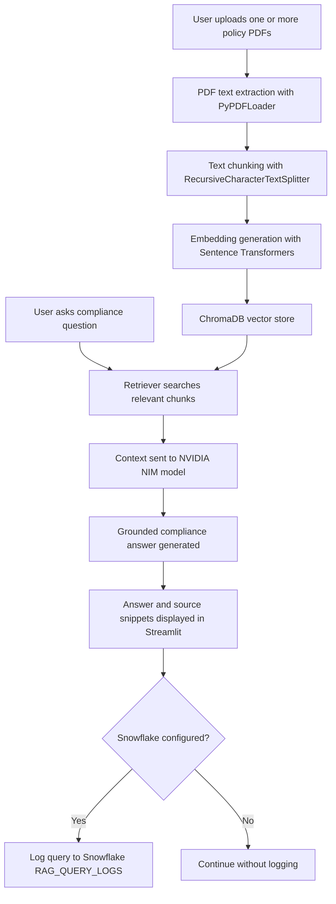
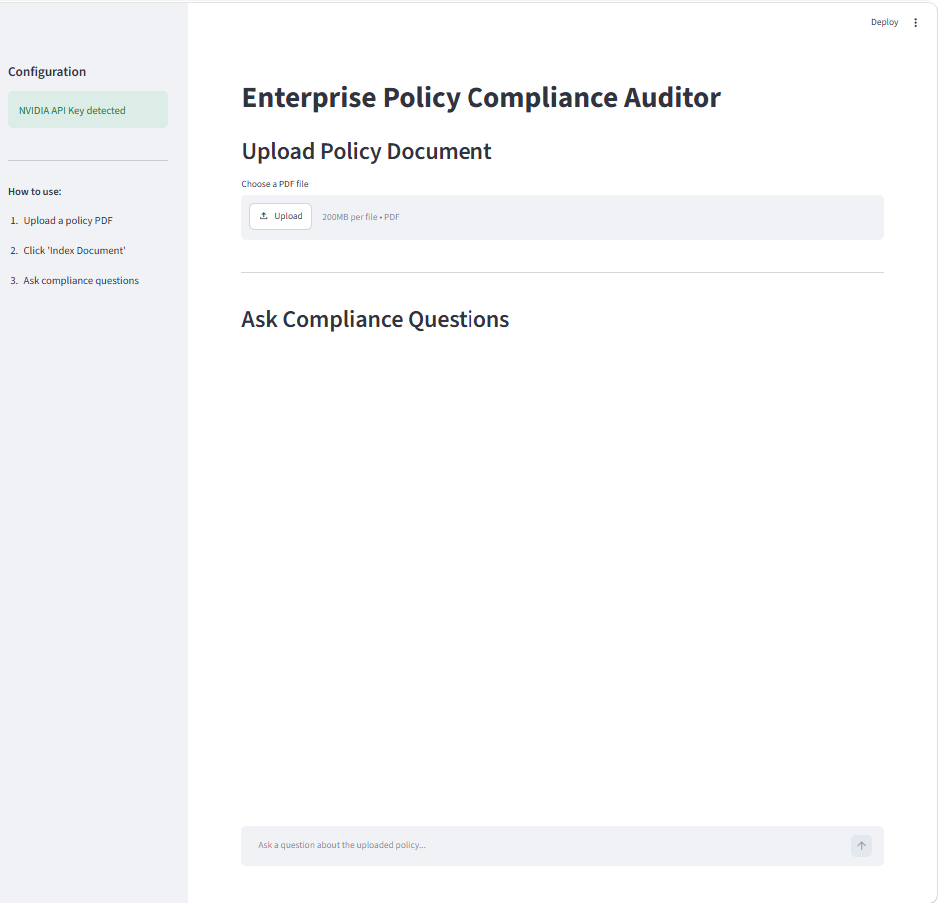
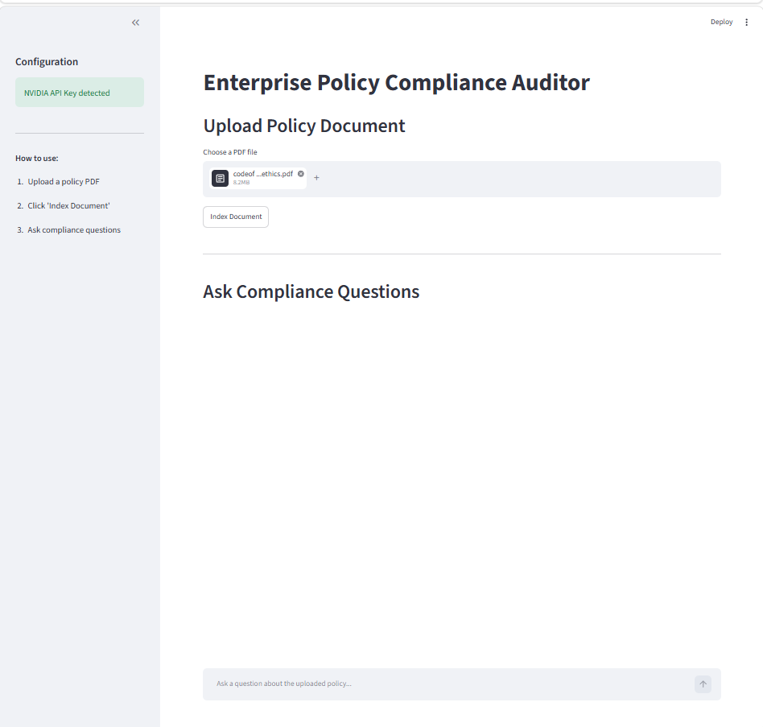
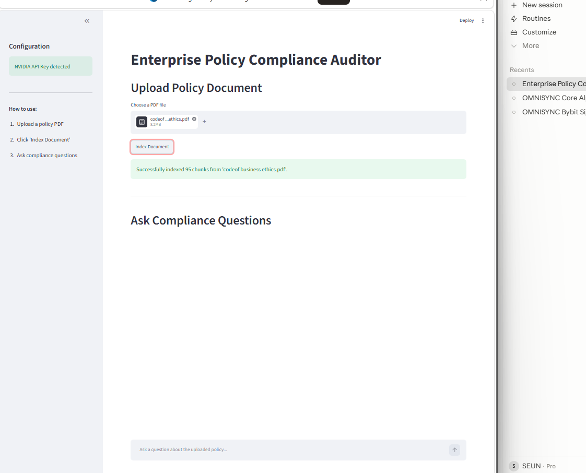
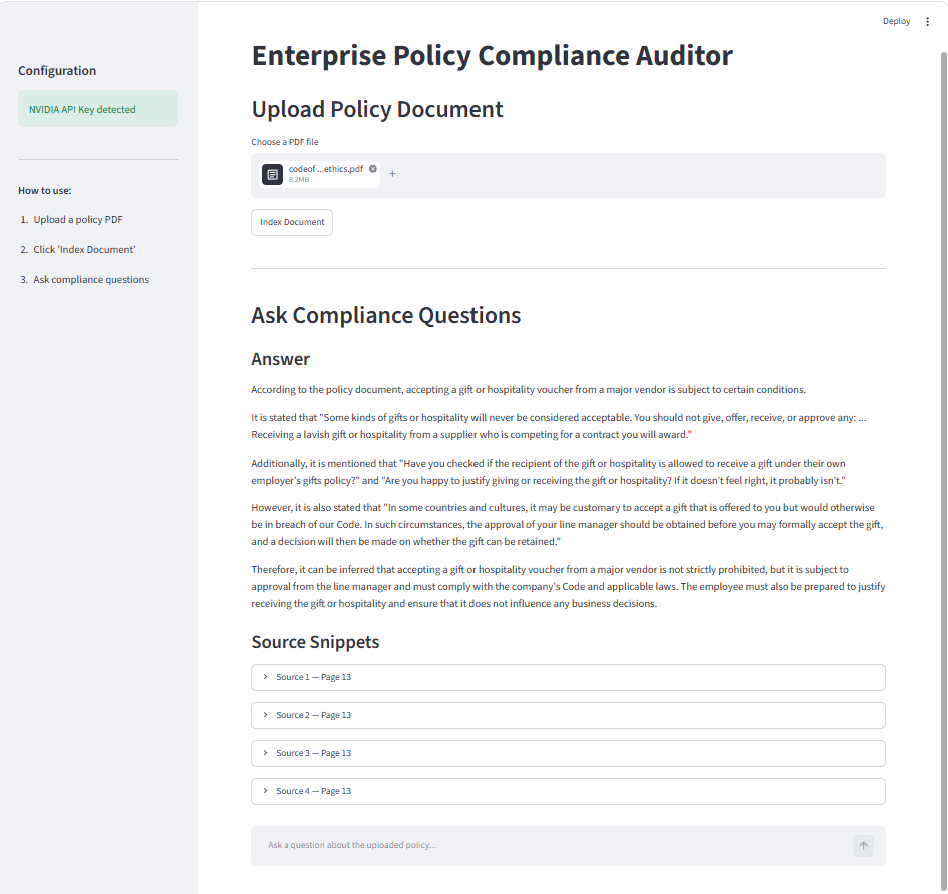
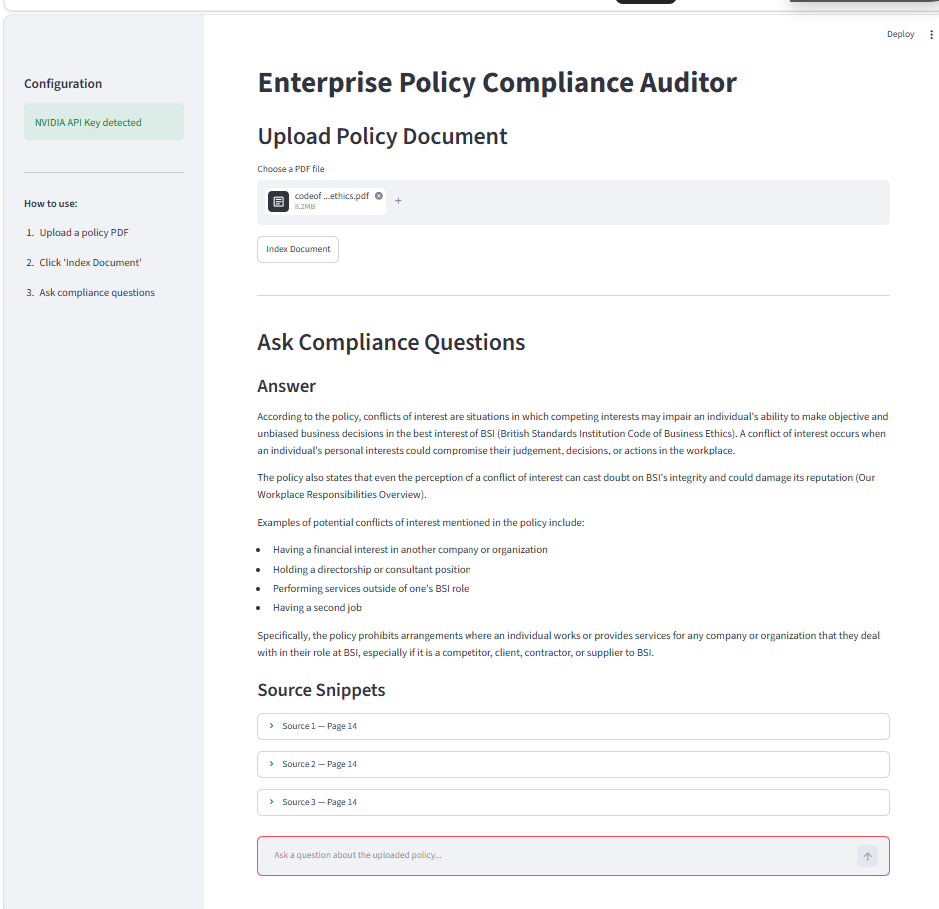
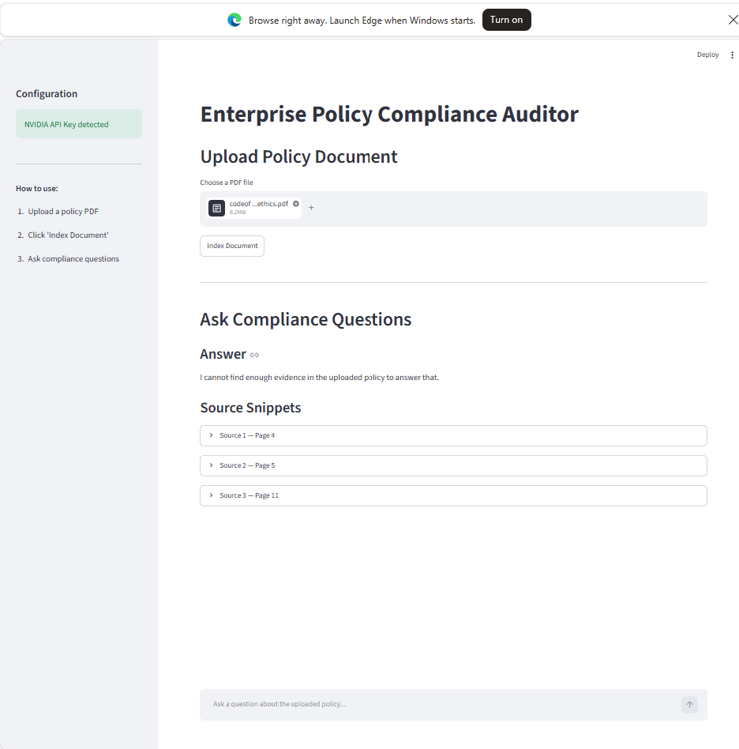

# Enterprise Policy Compliance Auditor

A Streamlit-based RAG (Retrieval-Augmented Generation) application that allows users to upload one or more corporate policy PDFs and ask compliance questions in natural language. Answers are grounded strictly in the uploaded documents, with source snippets showing the filename and page number for verification.

## Business Problem

Compliance teams, HR departments, and operations teams regularly need to search through lengthy policy documents to answer specific questions. Manually reviewing these documents is slow, inconsistent, and creates risk when clauses are missed or misinterpreted. Organizations need a faster, more reliable way to query their own policies.

## Solution

This application uses retrieval-augmented generation to solve the problem. When a user uploads a policy PDF, the app extracts the text, splits it into chunks, and stores the chunks as vector embeddings in ChromaDB. When the user asks a question, the app retrieves the most relevant sections from the vector store and sends them to NVIDIA NIM (`meta/llama-3.1-70b-instruct`) with a strict compliance auditor prompt. The model generates an answer using only the retrieved context. If the document does not contain enough evidence, the model explicitly refuses to answer rather than guessing.

## Key Features

- **Multi-Document Upload and Indexing** — Upload one or more policy PDFs and index them all into a single vector database with one click.
- **Document Chunking** — Text is split into overlapping chunks for accurate retrieval.
- **ChromaDB Vector Storage** — Document embeddings are stored locally in a persistent ChromaDB instance.
- **NVIDIA NIM Answer Generation** — Answers are generated by `meta/llama-3.1-70b-instruct` via NVIDIA NIM. The model is stored in a variable in `main.py` and can be changed to any supported NVIDIA NIM model with a single edit.
- **Source Snippets** — Every answer includes the exact document passages used, with the source filename and page number.
- **Strict Document Grounding** — The AI is constrained to answer only from the uploaded document content.
- **Hallucination Refusal** — When the documents do not contain enough evidence, the model responds: "I cannot find enough evidence in the uploaded policy documents to answer that."

## Tech Stack

| Component | Technology |
|-----------|------------|
| Language | Python |
| Frontend | Streamlit |
| LLM Orchestration | LangChain |
| Vector Database | ChromaDB |
| Embeddings | Sentence Transformers (all-MiniLM-L6-v2) |
| LLM | NVIDIA NIM (`meta/llama-3.1-70b-instruct`) |
| PDF Parsing | PyPDF |
| Audit Logging (optional) | Snowflake |
| Environment Management | python-dotenv |
| Version Control | Git / GitHub |

## Architecture



## Screenshots / Demo

### 1. App Homepage


### 2. PDF Uploaded and Ready to Index


### 3. PDF Indexed Successfully


### 4. Gifts and Hospitality Answer with Source Snippets


### 5. Conflicts of Interest Answer


### 6. Hallucination Control / Refusal Test


This test shows that when the uploaded policy does not contain enough evidence, the app refuses to invent an answer.

## Demo Video

A short demo video is included in this repository:

[Watch the demo video](demo/enterprise_policy_compliance_demo.mp4)

The video shows the Streamlit app answering policy questions with source snippets and refusing to answer when the uploaded policy does not contain enough evidence.

## Example Questions

- "What does the policy say about conflicts of interest?"
- "What should an employee do if they are offered a gift?"
- "What are the consequences of breaching the code?"
- "What does the policy say about remote working from another country?"

Users can query across multiple indexed policies at once. The last question serves as a hallucination-control test. If none of the uploaded policies mention remote working from another country, the app should refuse to answer rather than fabricating a response.

## Local Setup

Run these commands in Windows PowerShell:

```powershell
python -m venv venv
venv\Scripts\activate
python -m pip install -r requirements.txt
copy .env.example .env
python -m streamlit run app.py
```

After running `copy .env.example .env`, open the `.env` file and add your NVIDIA API key before starting the app.

## Environment Variables

This project requires one environment variable. Snowflake variables are optional. Add them to your `.env` file:

```
NVIDIA_API_KEY=your_nvidia_api_key_here

SNOWFLAKE_ACCOUNT=your_snowflake_account
SNOWFLAKE_USER=your_snowflake_user
SNOWFLAKE_PASSWORD=your_snowflake_password
SNOWFLAKE_WAREHOUSE=your_snowflake_warehouse
SNOWFLAKE_DATABASE=your_snowflake_database
SNOWFLAKE_SCHEMA=your_snowflake_schema
SNOWFLAKE_ROLE=your_snowflake_role
```

You can obtain a free API key from [build.nvidia.com](https://build.nvidia.com).

**Important:** The `.env` file contains your real API key and should never be committed to GitHub. It is already included in `.gitignore`. Only `.env.example` (which contains a placeholder) is safe to commit.

## Known Limitations

- Currently supports PDF documents only.
- Current version is a portfolio MVP, not a replacement for legal, HR, or compliance advice.
- Response speed depends on NVIDIA API and model availability.
- Source page numbering may depend on PDF metadata and loader behaviour.
- The vector store is local (ChromaDB persisted to disk).
- Re-indexing replaces the previous vector store; incremental additions are not yet supported.
- Snowflake logging is optional and requires separate credentials.
- Cloud deployment would require secure environment variable setup and possible persistence changes.

## Snowflake Audit Logging

Snowflake logging is an optional feature for governance and reporting. It does not replace ChromaDB, which remains the vector search engine. When Snowflake credentials are configured in `.env`, each query is logged to a `RAG_QUERY_LOGS` table with:

- User question and AI answer
- Source filenames and page numbers
- Evidence found status
- Model name and response time

If Snowflake credentials are missing, the app runs normally with logging disabled. The sidebar shows whether logging is enabled or disabled. Real credentials must be stored in `.env` and never committed to GitHub.

## Deployment

- This project currently runs locally.
- It can be deployed to Streamlit Cloud or another Python-compatible hosting platform.
- For deployment, environment variables (such as `NVIDIA_API_KEY`) must be configured securely in the hosting platform's settings. Do not upload `.env` to GitHub.
- ChromaDB local persistence may need adjustment for cloud deployment depending on the platform's filesystem and storage options.

## Lessons Learned

- Built a working RAG pipeline from PDF upload to source-grounded answer generation.
- Learned how to handle modern LangChain import and version changes.
- Improved performance by reducing retrieved chunks, limiting context size, lowering max tokens, and setting deterministic output.
- Tested hallucination control by asking a question not covered by the uploaded policy.
- Practised API key management, GitHub workflow, and README documentation.

## CI/CD

GitHub Actions is used for basic automated checks on every push and pull request to `main`. The workflow validates dependency installation, runs Python syntax checks on all core files, and verifies that required project files are present. The workflow does not run live NVIDIA API calls because API keys are kept private and are never committed to the repository. This supports safer version control and project maintainability.

## Future Improvements

- Incremental document indexing without replacing existing vectors.
- Downloadable compliance report generation.
- Better source citation formatting with section references.
- User authentication for team-based access.
- Deployment to Streamlit Cloud.
- Support for DOCX file uploads.
- Confidence scoring for generated answers.
- Admin dashboard for managing indexed documents.

## Portfolio Value

This project demonstrates practical AI engineering skills including:

- **Retrieval-Augmented Generation (RAG)** — end-to-end document Q&A pipeline.
- **Document Intelligence** — PDF parsing, text chunking, and embedding generation.
- **Vector Databases** — persistent storage and similarity search with ChromaDB.
- **LLM Integration** — connecting to NVIDIA NIM via LangChain.
- **Prompt Engineering** — strict grounding prompts with hallucination control.
- **Streamlit UI Development** — interactive frontend with upload, indexing, and chat.
- **API Key Security** — safe handling of credentials with dotenv and gitignore.
- **GitHub Version Control** — clean project structure ready for collaboration.
